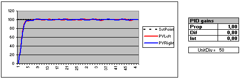

<html>

<head>
<meta http-equiv="Content-Language" content="en-us">
<meta name="GENERATOR" content="Microsoft FrontPage 4.0">
<meta name="ProgId" content="FrontPage.Editor.Document">
</head>

<b><i>PID control of two motors speed via serial
      port</i></b>
      
By Alejandro Alonso-Puig 
      January 2.005 

 
The presented system is a feedback control loop of type PID (Proportional
Integral Differential) that allows to control the speed of two motors (controls
PD) and to slave them (control I) so that both motors maintain a speed relation
in case one is forced by external agents to vary it.&nbsp;

This system of speed control is applicable for example to
robots with traction of differential type. Simply one indicates to the system
the wished speed (<i>SetPoint</i>) and the difference of speed (<i>Bias</i>)
that is to have between both motors (to be able to make turns). The system takes
care of all the rest.

The system is controllable by commands sent via serial port.
It is possible to specify not only the speed and Bias, but also the gains and
other parameters that we will see later.&nbsp;

Additionally the system allows to obtain the values of
several of its parameters via serial port.

&nbsp;

<b>HARDWARE</b>

<ul>
  <li>
    
<b>Motors</b>: Although the system is adaptable to
    different types of motors, those used in the test bench and for which PID
    gains are fit by defect in the program are the motors with gearhead and
    encoders from <i><b>Solution Cubed</b></i> (<a href="http://www.solutions-cubed.com" target="_blank">http://www.solutions-cubed.com</a>).
    Features: 12V, 200RPM, 3,6kgcm of torque, quadrature encoder (2 channels for
    detection of rotational direction) of 200CPR, that after the gearhead
    reduction allows to obtain 6000CPR.&nbsp; 
    <i><u>Important note</u>: The system is prepared to use quadrature encoders.
    If they are used incremental encoders of only one channel it will be
    necessary to connect them to RA4 and RC0, putting RB2 and RB3 to mass. It
    will not be possible to control negative speeds (reverse mode or absolute
    turns), obtaining an unstable result of the controller in his attempt. In
    any case it would be preferable to make modifications in the code to adapt
    it, since it can become unstable in values near zero.
     
    </i></li>
  <li>
    
<b>Control Card</b>: We have used the <i><b>Skypic</b></i>
    control card from <b>IEARobotics</b> with the PIC16F876 micro (<a href="http://www.iearobotics.com/proyectos/skypic/skypic.html" target="_blank">http://www.iearobotics.com/proyectos/skypic/skypic.html</a>).
    Such card have an RS232C port with the standard voltage levels (-12v, +12v)
    that could be directly connected to a PC serial port and control the system
    by using a terminal emulator application like hiperterminal. 
     
  </li>
  <li>
    
<b>Driver</b>: In order to give the motors the current
    needed we have used the MSE-A100 driver from Microsystems
    Engineering (<a href="http://www.msebilbao.com" target="_blank">http://www.msebilbao.com</a>),
    based on the L293B chip, that supports a couple of motors with 1A continuous
    and 2A peak current draw each.</li>
</ul>
<blockquote>

</blockquote>

<b>SOFTWARE</b>

The program that is in the controller has been developed in
C++ using the BoostC cross compiler from Pavel Baranov (<a href="http://www.picant.com/c2c/c.html">http://www.picant.com/c2c/c.html</a>).
We have used libraries for the control of the serial port of the
microcontroller, developed by Yann Hendrikx. The complete self explanatory
program can be downloaded from the following Link. It includes the sources in C,
the object &quot;motor.hex&quot; (ready to burn in the microcontroller) and the
intermediate version in assembler &quot;motor.asm&quot; generated by the cross
compiler:

<ul>
  <li>
    
Control program <a href="PID_2_motors_program">PID_2_motors_program</a> </li>
</ul>

For the control from the PC a terminal emulator application
like Hiperterminal is used, configured as 9600, n, 8, 1

From the hyperterminal the following commands are used for
the control of the system:

  

  <table border="1" width="68%" height="1386">
    <tr>
      <td width="20%" height="418" align="center"><b>Set Speed</b></td>
      <td width="80%" height="418">A first byte of value 32 is sent (space).
        Next the speed is sent in the following byte. value 50 (character
        &quot;2&quot;) indicates null speed. Inferior values correspond to
        negative speed (reverse mode) and greater values correspond to positive
        speed (forward mode). The program takes the sent code and multiplies it
        by 10. Therefore the speed (<i>SetPoint</i>) used by the program will be
        <i>(code-50)*10</i>
        
This speed is measurement in cycles from encoder by each 10 msg (<i>Kpause</i>
        parameter in the program). Thus, depending on the encoder used, the
        speed can vary. For motors with encoder of N cycles per revolution of
        the axis (CPR), in order to get a speed of <i>V</i> (RPM), the speed (<i>SetPoint</i>)
        would be (<i>V * N * Kpause)/60.000. </i>As <i>code=50+SetPoint/10</i>
        then, the code to send would be <i>code=50+ V * N * Kpause/600.000</i>

        
Thus for example, for the configuration used in the test bench, where
        N=6.000CPR and <i>Kpause</i>=10. In order to make the motors go at
        100RPM would be necessary to send the speed code 50+100*6.000*10/600.000=60
        (character &quot;&lt;&quot; of ASCII table).&nbsp;

        
In summary, pressing the space key and then the key &quot;&lt;&quot;
        would set the motor to 100RPM forward.

      </td>
    </tr>
    <tr>
      <td width="20%" height="475" align="center"><b>Change the default value of
        <i>Kpause</i></b>&nbsp;</td>
      <td width="80%" height="475">The value by defect of <i>Kpause</i> can be
        modified by sending first the code 37 (symbol % in the ASCII table) and
        then the value, considering that value 50 corresponds to a null <i>Kpause</i>.
        Thus, the value assigned to <i>Kpause</i> will be the one sent minus 50.
        For example, if code 60 is sent (character &quot;&lt;&quot; of ASCII
        table), <i>Kpause</i> will be 10 (60-50). If values smaller than 50 are
        sent, <i>Kpause</i> will become null.
        
It could be necessary to modify <i>Kpause</i> depending on the CPR of
        the encoder used. The program internally uses a register of 8 bits for
        each motor, that counts the cycles coming from encoder. If the CPR of
        the encoder are very high and <i>Kpause</i> is also high, they could
        happen that the registers overflow giving wrong speed values to the
        control loop. Therefore <i>Kpause</i> has to have a value (in msg) so
        that the motor at max speed does not produce more than 255 cycles of
        encoder. For example, for a motor of max speed <i>V</i> (RPM) at the
        shaft and encoder of N cycles per revolution of the shaft (CPR), the
        value of <i>Kpause</i> does not have to be greater than<i>
        (60.000*255)/(V*N)</i>

        
Thus for example, for the configuration used in the test bench, where
        N=6.000CPR and V=200RPM, the value of <i>Kpause</i> had to be less than
        (60,000 * 255)/(200*6.000)= 12'75. <i>Kpause</i> is number of one byte,
        so it would be 12 at the most.&nbsp;

        
In summary, to establish a <i>Kpause</i> of 20, key % would be
        pressed (code 37) and then key F (code 70)

      </td>
    </tr>
    <tr>
      <td width="20%" height="133" align="center"><b><i>Bias</i></b></td>
      <td width="80%" height="133">The value of the <i>Bias</i> indicates the
        relative speed of the left motor respect to the right motor. A positive <i>Bias</i>
        makes the left motor to go faster than right motor and a negative <i>Bias</i>
        do the opposite. Basically for a specific speed (<i>SetPoint</i>), the
        motor speed would be:
        
<i>Vi =SetPoint + Bias/2 
        Vd =SetPoint - Bias/2</i>

      </td>
    </tr>
    <tr>
      <td width="20%" height="266" align="center"><b>Gains</b>  &nbsp;</td>
      <td width="80%" height="266">In order to vary the gains by default of the
        PID controller, first it is necessary to send a code that indicates the
        gain to vary:&nbsp;
        <ul>
          <li>Code 34 (Character quotes (&quot;) of ASCII table) for the
            Proportional gain (<i>Kpro</i>)&nbsp;</li>
          <li>Code 35 (Character hash (#) of ASCII table) for the Integral gain
            (<i>Kint</i>)</li>
          <li>Code 36 (Character dollar ($) of ASCII table) for the Differential
            gain (<i>Kdif</i>)&nbsp;</li>
        </ul>
        
After this code is sent, the value of the gain should be sent in 1/50
        units, starting in code 50 (code 50 indicates gain 0). Thus for example,
        to establish a <i>Kint</i> gain of 0.02 first would be sent code 35 and
        then code 0,02*50+50 = 51
      </td>
    </tr>
    <tr>
      <td width="20%" height="39" align="center"><b>Request of data</b></td>
      <td width="80%" height="39">Sending code 38 (character &amp; of ASCII
        table) the request of data status is activated and sending code 39 (character
        ' of ASCII table) the request of data is deactivated.&nbsp;
        
When activating the request of data, the controller starts sending
        continuously&nbsp; the following control values via serial port:

        <ul>
          <li><i>SetPoint</i>: Speed of reference</li>
          <li><i>PVLeft</i> : Real speed as per left encoder</li>
          <li><i>PVRight</i>: Real speed as per right encoder</li>
          <li><i>Kpro</i>: Proportional Gain in 1/50 units, therefore if it
            shows 20, the real gain used would be 20/50=0,4&nbsp;</li>
          <li><i>Kdif</i>: Differential Gain in units of 1/50&nbsp;</li>
          <li><i>Kint</i>: Integral Gain in units of 1/50&nbsp;</li>
          <li><i>Bias</i>&nbsp;</li>
          <li><i>Kpause</i>&nbsp;</li>
        </ul>
        
Next we will show how useful is to collect these data in the computer
        to see the behavior of the system and to adjust the gains suitably.
      </td>
    </tr>
  </table>
  

<i>Note: The units used are a bit complex, but it has been
necessary to do it in this way to adapt the program to the limitations of the
compiler, between whom it is the lack of&nbsp; floating point variables and the
limitation of long numbers to values of 16 bits.&nbsp;</i>

Activating the request of data we obtain a continuous list of
feedback values from the system that could be used by PC applications to have
permanent information of the system and to make the adjustments needed.

Next it is showed a manual method to adjust the gains of the
controller.&nbsp;

The method consists on maintaining the motor stopped. Send to
the system via serial port the values of <i>Kpro</i>, <i>Kint</i> and <i>Kdif</i>
wished. Activate the capture of data from the hyperterminal and indicate the
system to set the motor speed up to 100RPM. After a couple of seconds we could
stop the motor and stop the capture

The following excel spreadsheet could be used to visualize
the captured data:

<ul>
  <li>
    
<a href="pidtest.xls">pidtest.xls</a> (.xls
    120Kb)</li>
</ul>

The data of the capture will be copied and pasted in the B17
cell, with which the graph of behavior of both motors will be drawn
automatically. See the following example:

&nbsp;

In a visual way it is possible to see the behavior of the
controller and adjust the gains until obtaining interesting results:

&nbsp;

<b><i>Gains tuning</i></b>

There are several theories for the manual adjustment of gains
of PID controller with no need to get into mathematics formulation. There are
several links at referring these theories at the end of the page. Basically the
methodology that I have followed has been the following one, extracted of the
mentioned theories.

&nbsp;

<ol>
  <li>
    
Start with a value of proportional gain equal or smaller
    than one and set the other gains to zero. When annulling the integral gain
    is annulled the influence of the speed of a motor on the other. Check the
    results. Example:</li>
</ol>

 

<ol>
  <li value="2">
    
Raise sluggishly the value of the proportional gain
    maintaining the other gains zero until the graph shows oscillations.
    Example:</li>
</ol>

 

<ol start="4">
  <li value="3">
    
Keep the integral gain to zero and set a differential
    gain 10 times inferior to the proportional one.&nbsp;</li>
  <li>
    
See the results raise de differential gain until the
    graph shows no oscillations. Example:</li>
</ol>

 

<ol dynamicoutline>
  <li value="5">
    
Having the P and D gains already established, start setting
    a minimum integral gain (0.02 are the minim supported by the program) and
    observe the results. Raise the integral gain little by little until both
    motors begin to oscillate and get into resonance.</li>
</ol>
    

<ol dynamicoutline>
  <li value="6">
    
Then divide the integral gain by 10 or 20. Gain will be
    correct when the graph doesn't show oscillations and when trying to force by
    hand one motor to stop, the other tends also to stop by itself (Keep in mind
    that the current draw of a stacked motor tends to go up very fast. The motor
    driver used has to give sufficient power or it will overheat). Example:</li>
</ol>

 

   
  <b>BIBLIOGRAPHY</b>

<table border="0" width="80%">
  <tr>
    <td width="5%" valign="top">
    </td>
    <td width="95%">Book &quot;Building your Robot Drive Trains&quot;. Dennis
      Clark and Michael Owings. Ed. TAB Robotics. ISBN 0-007-140850-9. Chapter 8
      - Motor Control 201. Closing the loop with feedback.
    </td>
  </tr>
  <tr>
    <td width="5%" valign="top">
    </td>
    <td width="95%">Book &quot;Mobile Robots&quot;. Josephe L. Jones et al. Ed.
      A.K.Peters. ISBN 1-56881-097-0. Chapter 7; 7.8.2 - Feedback Control Loops
    </td>
  </tr>
  <tr>
    <td width="5%" valign="top">
    </td>
    <td width="95%">PID Without a PhD (Easy guide to PID control algorithms and
      gains tuning)  :
      <a href="PID-without-PhD.pdf" target="_blank"> PID-without-PhD.pdf</a>&nbsp;
    </td>
  </tr>
  <tr>
    <td width="5%" valign="top"></td>
    <td width="95%">Documentation of SkyPic control card: <a href="http://www.iearobotics.com/wiki/index.php?title=Skypic" target="_blank">http://www.iearobotics.com/wiki/index.php?title=Skypic</a>
    </td>
  </tr>
</table>

  </blockquote>
</blockquote>

</body>

</html>
